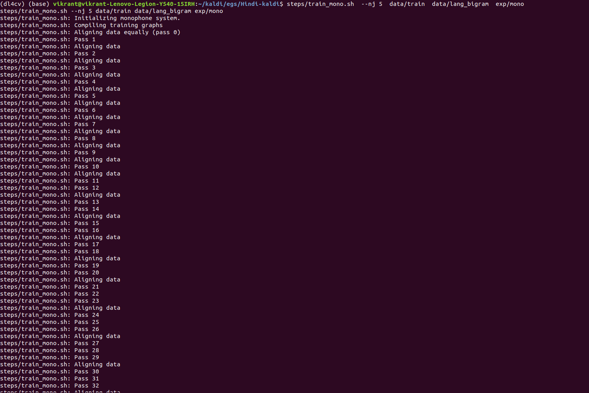
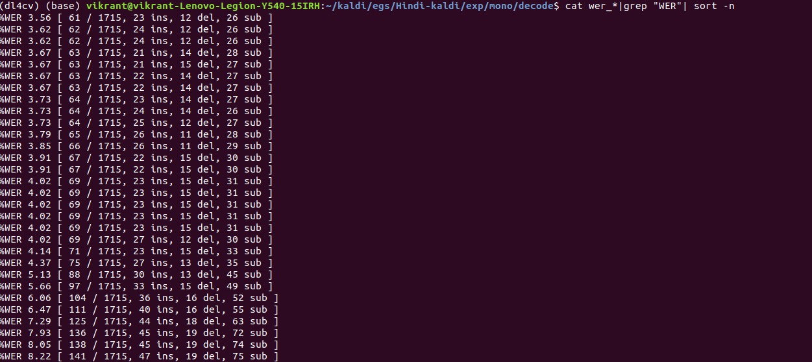
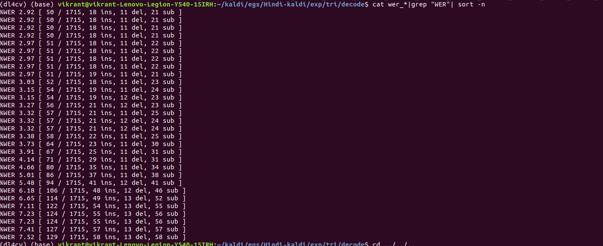
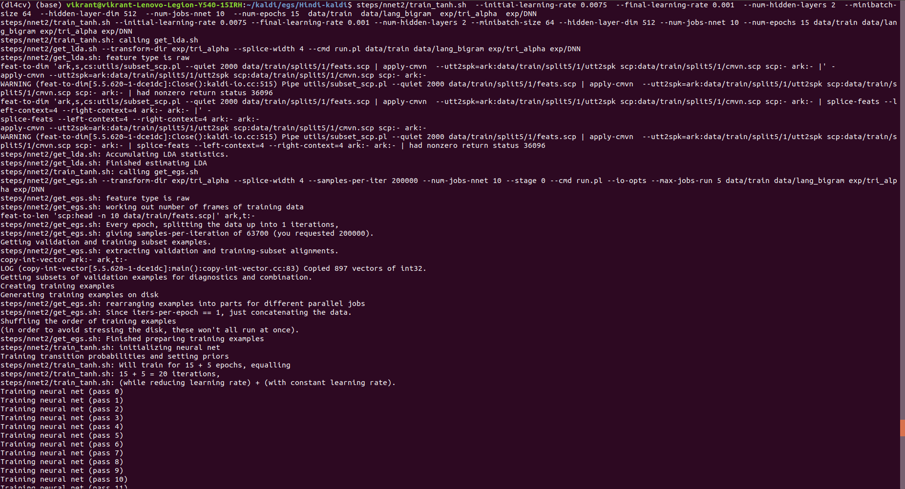
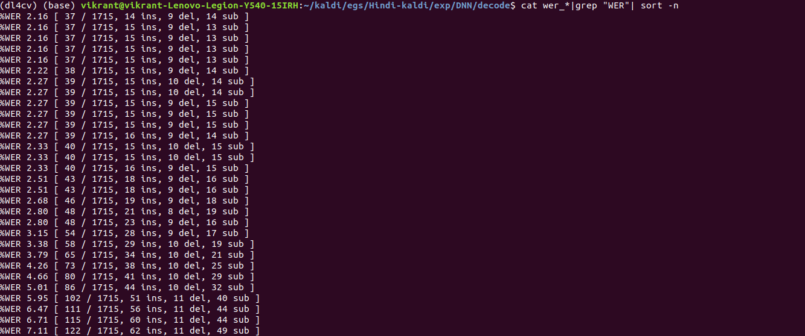

In this project, I tried to build an Automatic Speech Recognition system for Hindi using the famous Kaldi Toolkit. The entire code along with the speech data can be found on my GitHub page: https://github.com/OhmVikrant/ASR-for-Hindi 

I would try to explain a little bit about the processing the data, language and acoustic modeling along with the steps. If you already have enough knowledge regarding how ASR using Kaldi works, you can directly implement the code given in steps serially in the file steps.txt inside the GitHub repository.

## Data preprocessing
The data was collected and by Kunal Dhawan, a fourth-year undergrad from IIT Guwahati. It contains 150 sentences spoken by 7 different speakers. The speech corpus was in raw Devanagari script transliterated following the ILSL12 convention, and manually corrected in various places. Then the word-level and phone-level decomposition is done. The order of writing the contents in uttspk and other files can be learnt from the official documentation of Kaldi: https://kaldi-asr.org/doc/data_prep.html Then out of 1050 utterances, 910 were separated as train data and rest 140 as test data.

## Language Modeling

First the shell files are made executable with the command

>chmod +x (file_name)

A bigram language model (the n_gram is set to 2 here) is now created by executing the command

>./Create_ngram_LM.sh

The output is: 

## Acoustic Modeling

### Monophone GMM-HMM training

Monophone means a context-independent phone. Monophone training is the first step before training with context-dependent phones.
First thing we should do is fix the folder structure of both train and test data:

> utils/fix_data_dir.sh data/train

> utils/fix_data_dir.sh data/test

After successful validation, we extract the MFCC features of the audio files:

> steps/make_mfcc.sh --nj 5 data/train exp/make_mfcc/train mfcc

> steps/make_mfcc.sh --nj 5 data/test exp/make_mfcc/test mfcc

Then we perform speaker normalization:

> steps/compute_cmvn_stats.sh data/train exp/make_mfcc/train mfcc

> steps/compute_cmvn_stats.sh data/test exp/make_mfcc/test mfcc

Again testing the validation of data directory:

> utils/validate_data_dir.sh data/train

> utils/validate_data_dir.sh data/test

Now comes the training part:

> steps/train_mono.sh --nj 5 data/train data/lang_bigram exp/mono

We get something like this:

Now we need to form the graph of our model which would combine our language and acoustic models for best symbolization of the training. We execute:

> utils/mkgraph.sh --mono data/lang_bigram exp/mono exp/mono/graphD

We get:

Then we do decoding that is how our system performs with unseen test data:

> steps/decode.sh --nj 5 exp/mono/graph data/test exp/mono/decode

Now we output for our model:

> cd exp/mono/decode ; cat wer_*|grep "WER"| sort -n

We get the least value of WER% as 3.56%.

Before moving on to the next part let us know what WER means. Word Error Rate (WER) is a common metric of the performance of a speech recognition or machine translation system, computed by:

where
* S is the number of substitutions,
* D is the number of deletions,
* I is the number of insertions,
* C is the number of correct words,
* N is the number of words in the reference (N=S+D+C)

So in the last instance, the minimum WER% of 3.56% gave 61 out of 1715 were decoded incorrectly with 23 insertions, 12 deletions and 26 substitutions.

### Triphone GMM-HMM training

A triphone is a sequence of three phonemes, hence a context-dependent phone. Triphones are useful in models of natural language processing where they are used to establish the various contexts in which a phoneme can occur in a particular language.

We align the monophone system to obtain the phone boundaries, while also boosting the silence for better performance in noisy environments. We run from the parent directory:

> steps/align_si.sh --boost-silence 1.25 --nj 5 data/train data/lang_bigram exp/mono exp/mono_alpha

Now we train the triphone model:

> steps/train_deltas.sh 2000 16000 data/train data/lang_bigram exp/mono_alpha exp/tri

2000 is the value of the maximum number of senons we want to fit and 16000 is the maximum number of gaussians to be modelled.

Similar to monophone training, we run:

> utils/mkgraph.sh data/lang_bigram exp/tri exp/tri/graph

> steps/decode.sh --nj 5 exp/tri/graph data/test exp/tri/decode

> cd exp/tri/decode ; cat wer_*|grep "WER"| sort -n

The WER% comes out to be 2.92%.

### DNN-HMM training  

First we align the triphone model from the parent directory:

> steps/align_si.sh --nj 5 data/train data/lang_bigram exp/tri exp/tri_alpha

Then we train the DNN state emission model:

> steps/nnet2/train_tanh.sh --initial-learning-rate 0.0075 --final-learning-rate 0.001 --num-hidden-layers 2 --minibatch-size 64 --hidden-layer-dim 512 --num-jobs-nnet 10 --num-epochs 15 data/train data/lang_bigram exp/tri_alpha exp/DNN

The command seems to be complex but is actually very simple and self-explanatory.

Then like the earlier models, we go through:

> steps/nnet2/decode.sh --nj 4 exp/tri/graph data/test exp/DNN/decode

> cd exp/DNN/decode ; cat wer_*|grep "WER"| sort -n

This is our best system with WER% of 2.16%. With more data and more manipulation with the parameters and hyperparameters, the accuracy can be improved manifold.
