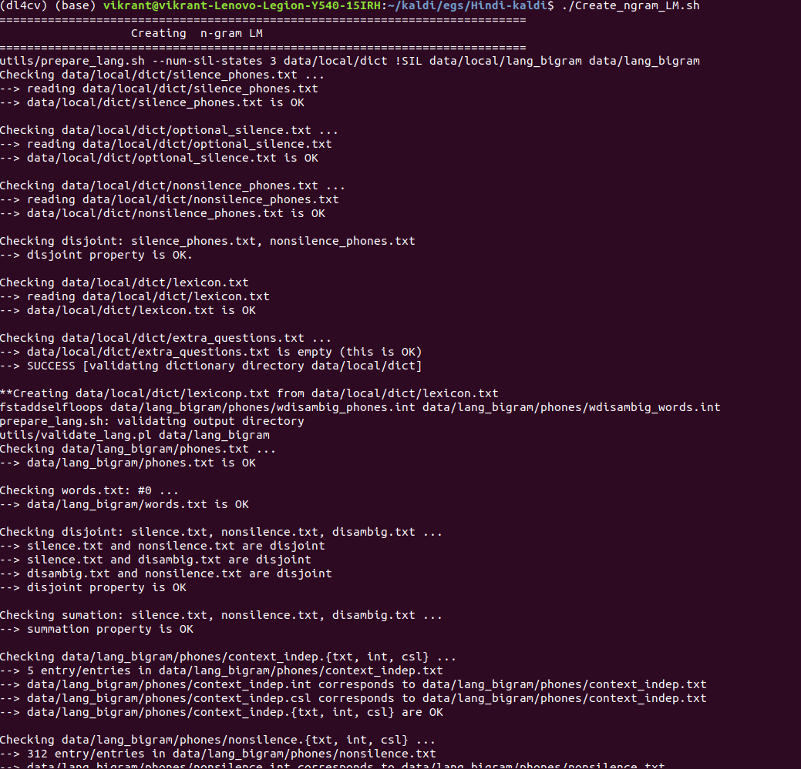

In this project, I tried to build an Automatic Speech Recognition system for Hindi using the famous Kaldi Toolkit. The entire code along with the speech data can be found on my GitHub page: https://github.com/OhmVikrant/ASR-for-Hindi 

I would try to explain a little bit about the processing the data, language and acoustic modeling along with the steps. If you already have enough knowledge regarding how ASR using Kaldi works, you can directly implement the code given in steps serially in the file steps.txt inside the GitHub repository.

### Data preprocessing
The data was collected and by Kunal Dhawan, a fourth-year undergrad from IIT Guwahati. It contains 150 sentences spoken by 7 different speakers. The speech corpus was in raw Devanagari script transliterated following the ILSL12 convention, and manually corrected in various places. Then the word-level and phone-level decomposition is done. The order of writing the contents in uttspk and other files can be learnt from the official documentation of Kaldi: https://kaldi-asr.org/doc/data_prep.html Then out of 1050 utterances, 910 were separated as train data and rest 140 as test data.

### Language Modeling

First the shell files are made executable with the command
>chmod +x (file_name)

A bigram language model (the n_gram is set to 2 here) is now created by executing the command
>./Create_ngram_LM.sh

The output is: 

### Acoustic Modeling

